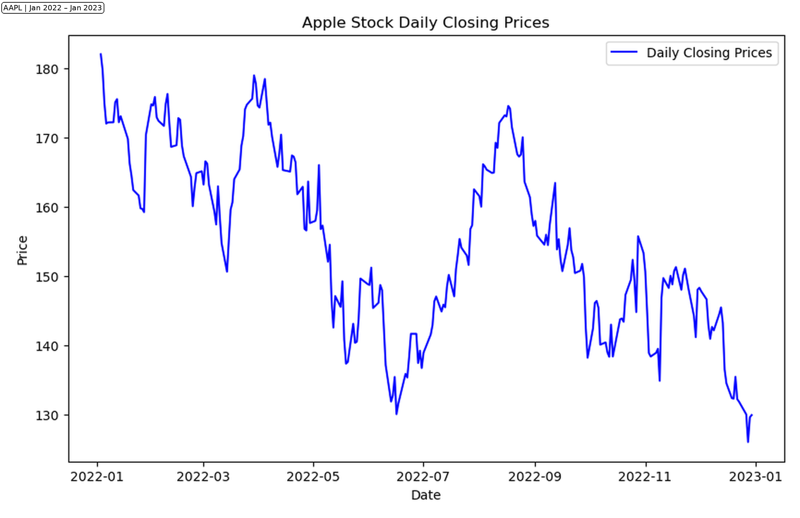
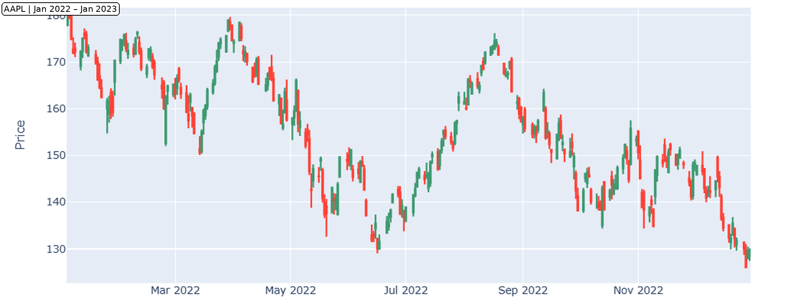
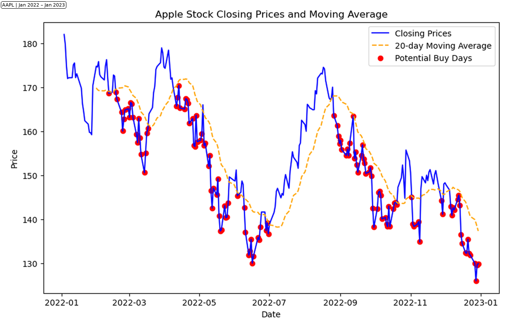
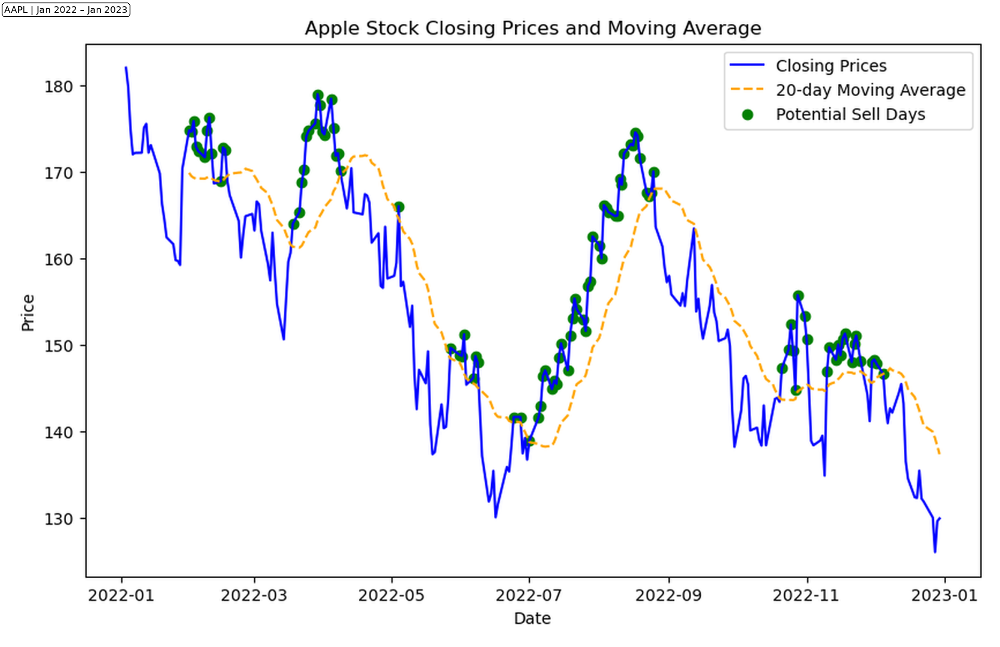

# Apple Stock Analysis (AAPL) | Python Time-Series Project

**Course Project:** BUAN-651 (Intro to Data & Programming)  
**Built:** December 2023  
**Author:** Shweta Prasad

## Project Overview
This project analyzes historical Apple (AAPL) stock price data from **Jan 2022 to Jan 2023** using Python.  
The analysis focuses on time-series trends, resampling, and moving-average based buy/sell signal exploration.

## Tools & Libraries
- Python
- pandas
- matplotlib
- yfinance
- mplfinance
- Jupyter Notebook

## Project Files
- Notebook: `notebooks/AAPL_Stock_Analysis_Fixed_REGEN_2026-01-15.ipynb`
- Report: `reports/Stock Analysis Report.pdf`
- Charts: `images/`

## Visualizations

## Disclaimer
For academic/portfolio use only — not financial advice.
